# Vim-Sexp Demos

These short demos show common vim-sexp editing operations. Each demo includes a
caption, a small Lisp fixture, and a generated GIF.

The GIFs are generated from asciinema casts so they can be rebuilt after
changing fixtures, captions, timing, or plugin behavior.
Each generated caption labels the initial state as `Before:` and the resulting
state as `After:` so looping GIFs remain readable when opened mid-cycle.

## Building

Required tools:

- `nvim`
- `asciinema`
- `agg`
- `gifsicle`

If `nvim` is installed as an AppImage on a system without FUSE, extract the
AppImage and point `nvim` or `DEMO_VIM` at the extracted executable:

```sh
nvim --appimage-extract
DEMO_VIM=/path/to/squashfs-root/AppRun make demos
```

By default, the demo runner adds `~/.local/share/nvim/lazy/nvim-treesitter` to
Neovim's runtimepath so `nvim -u NONE` can still load Treesitter parsers. If
your nvim-treesitter checkout lives elsewhere, set `DEMO_TS_RTP`:

```sh
DEMO_TS_RTP=/path/to/nvim-treesitter make demos
```

Generate all demos:

```sh
make demos
```

Generate one demo:

```sh
make demos/gifs/wrap-element.gif
```

Remove generated recordings and GIFs:

```sh
make clean-demos
```

## Visual Tour Demos

### Element Motions

Command: `<M-w>`, `<M-w>`, `<M-e>`, `<M-b>`

[](gifs/element-motions.gif)

[Open GIF directly](gifs/element-motions.gif)

### Retarget Visual Selection

Command: `vaf`, `]e`, `]e`, `[e`

[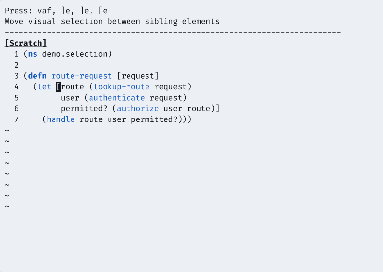](gifs/select-adjacent.gif)

[Open GIF directly](gifs/select-adjacent.gif)

### Flow Across List Boundaries

Command: `<M-]>`, `<M-]>`, `<M-]>`, `<M-}>`, `<M-}>`, `<M-}>`

[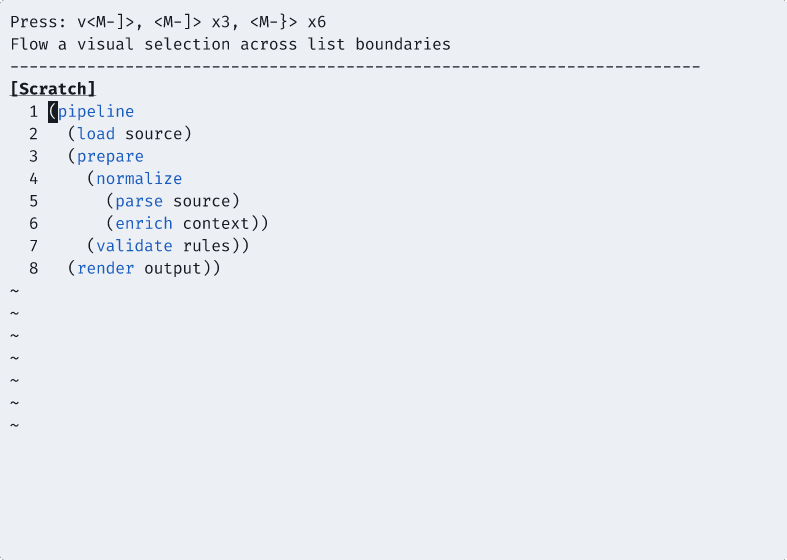](gifs/flow-selection.gif)

[Open GIF directly](gifs/flow-selection.gif)

### Wrap Element

Command: `<LocalLeader>w`

[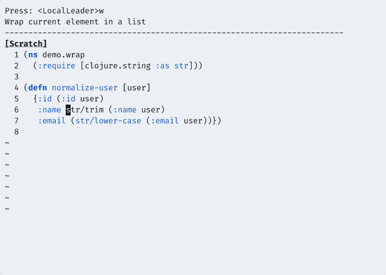](gifs/wrap-element.gif)

[Open GIF directly](gifs/wrap-element.gif)

### Splice List

Command: `<LocalLeader>@`

[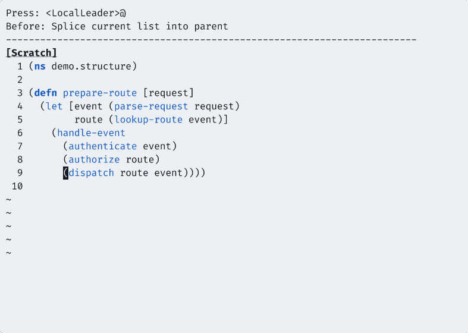](gifs/splice-list.gif)

[Open GIF directly](gifs/splice-list.gif)

### Capture Next Elements

Command: `<M-S-l>`

[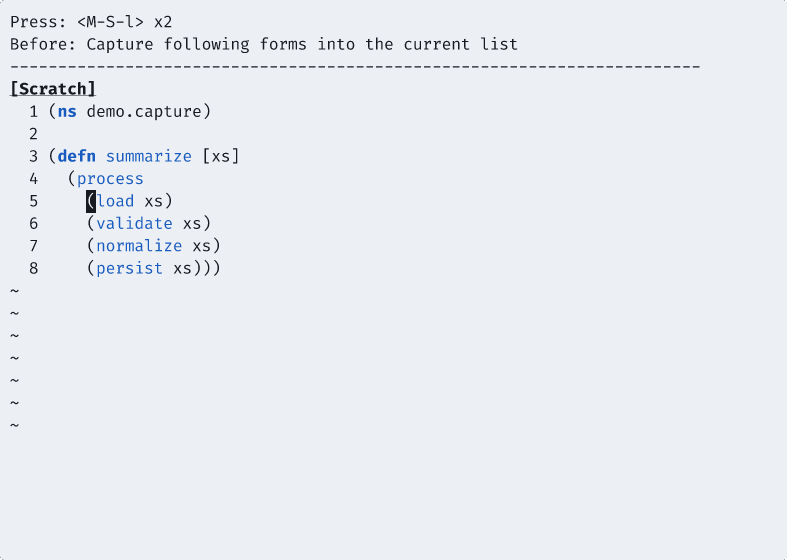](gifs/capture-next.gif)

[Open GIF directly](gifs/capture-next.gif)

### Emit Tail Elements

Command: `<M-S-k>`

[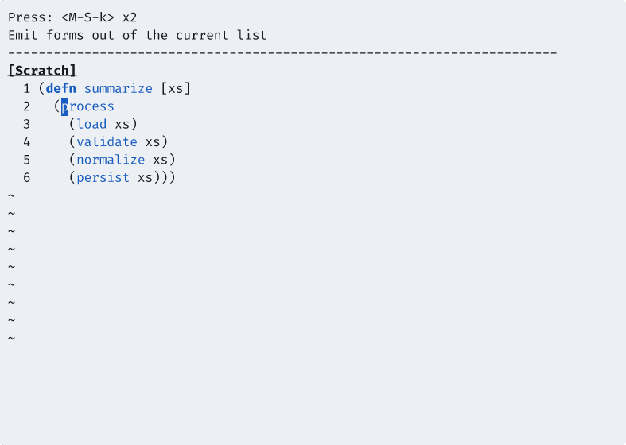](gifs/emit-tail.gif)

[Open GIF directly](gifs/emit-tail.gif)

### Swap Element

Command: `<M-l>`

[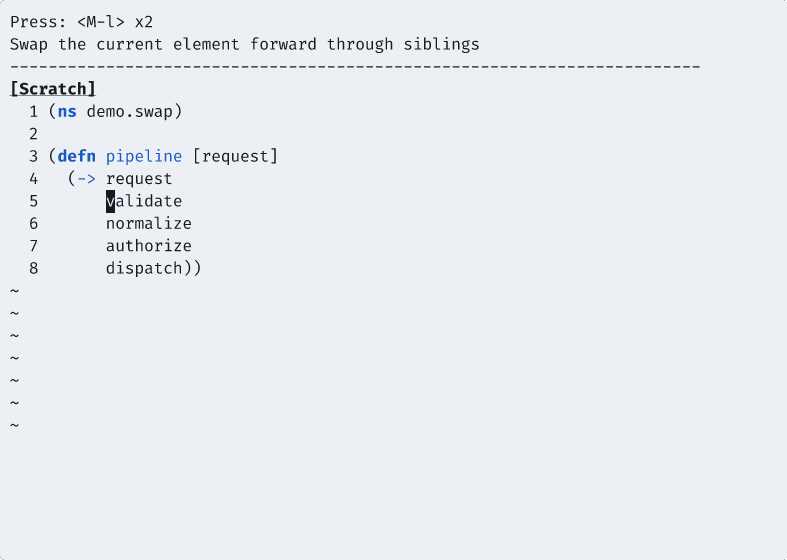](gifs/swap-element.gif)

[Open GIF directly](gifs/swap-element.gif)

### Clone List

Command: `<LocalLeader>c`

[](gifs/clone-list.gif)

[Open GIF directly](gifs/clone-list.gif)

### Smart Paste

Command: `p`

[](gifs/smart-paste.gif)

[Open GIF directly](gifs/smart-paste.gif)

### Put Into List

Command: `<LocalLeader>>p`

[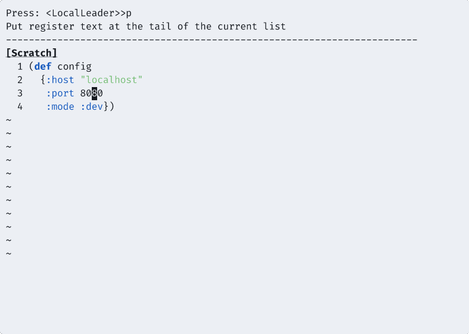](gifs/put-into-list.gif)

[Open GIF directly](gifs/put-into-list.gif)

### Convolute

Command: `<LocalLeader>?`

[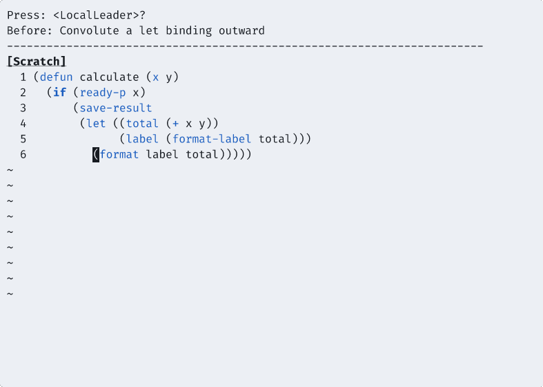](gifs/convolute.gif)

[Open GIF directly](gifs/convolute.gif)

### Cleanup And Align Comments

Command: `==`

[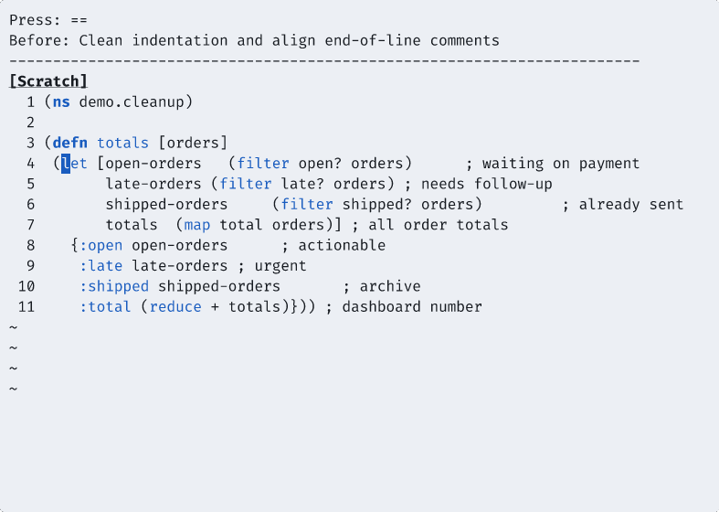](gifs/cleanup-align.gif)

[Open GIF directly](gifs/cleanup-align.gif)

### Align Comments With Custom Limits

Command: `<LocalLeader>a`

[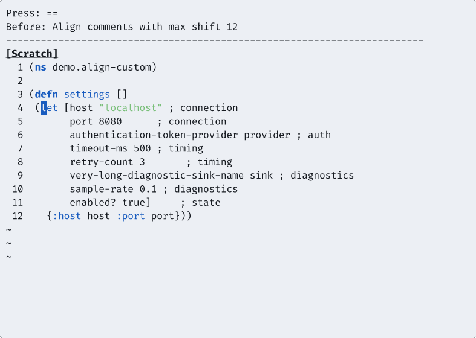](gifs/align-custom.gif)

[Open GIF directly](gifs/align-custom.gif)
